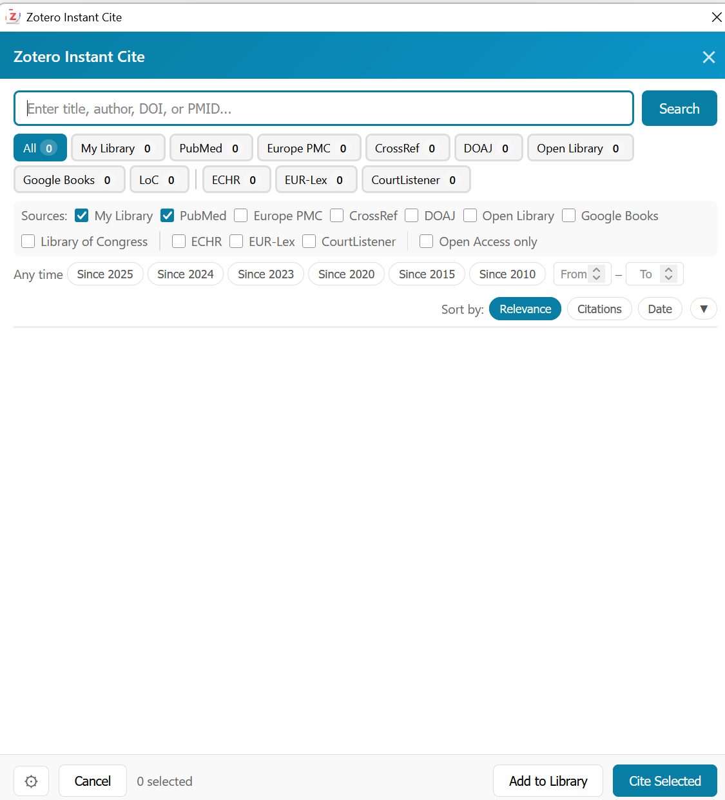
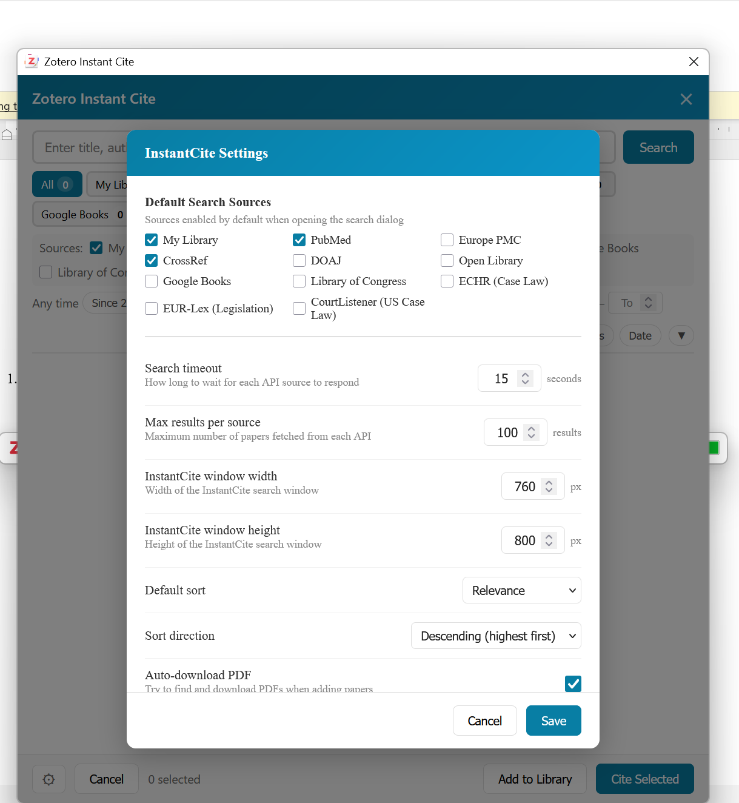
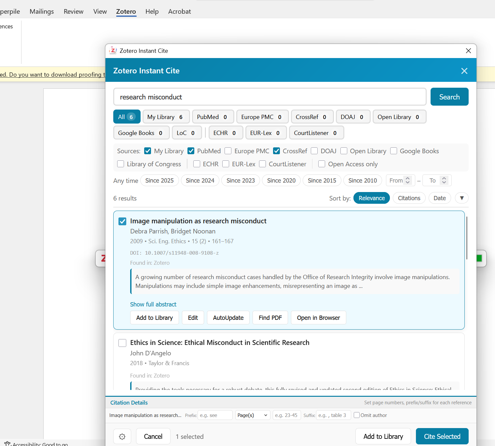
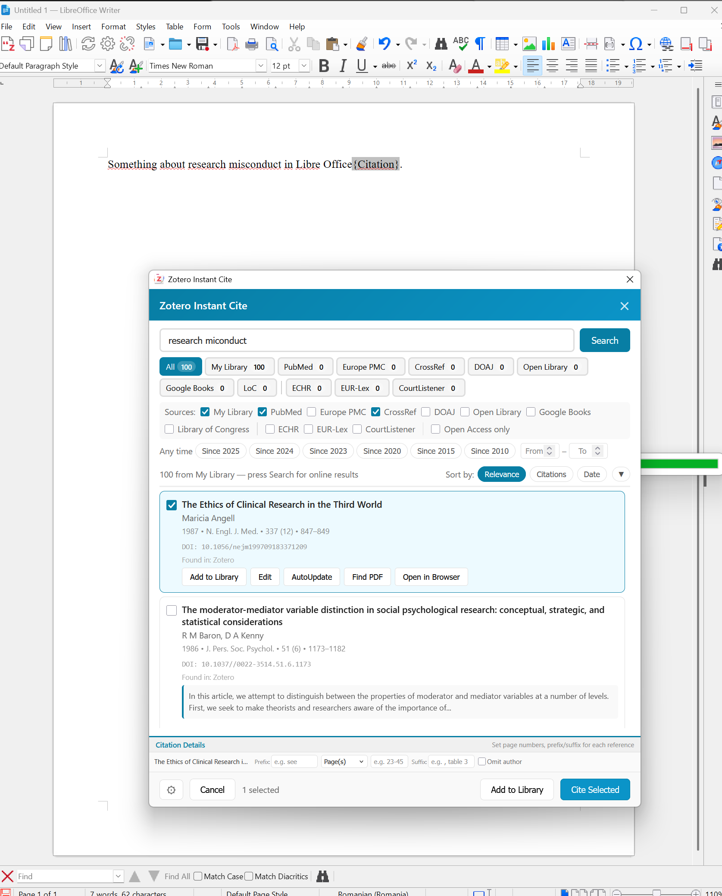
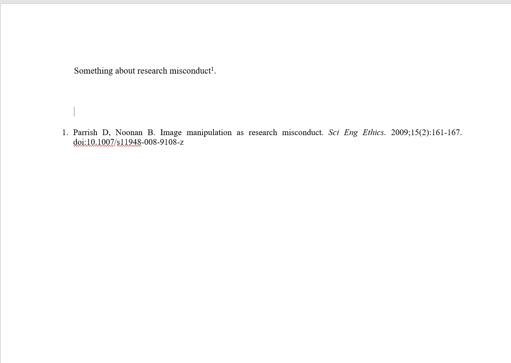

# Instant Cite

Instant Cite joins bibliographic search, reference management, and citation in one Zotero workflow for Microsoft Word and LibreOffice.



## What it does

- Searches by title, author, keyword, DOI, or PMID.
- Queries your Zotero library and the academic, bibliographic, or legal sources you enable.
- Orders results by relevance and checks them against items already in your library.
- Shows authors, publication, year, DOI, and abstract before you cite.
- Can locate an open-access PDF when one is available.
- Inserts citations in Word or LibreOffice and keeps the bibliography linked to Zotero.

## Workflow

Choose the sources and search options in Zotero.



Select a result from Word or LibreOffice. Instant Cite adds the item to Zotero when needed, then hands it to Zotero's citation dialog.





The inserted citation and bibliography remain editable through Zotero.



## Installation

1. Download the latest `.xpi` from [Releases](https://github.com/sorinhostiuc/zotero-instant-cite/releases/latest).
2. In Zotero, open **Tools > Plugins**.
3. Choose **Install Plugin From File**, select the `.xpi`, and restart Zotero if asked.

Instant Cite supports Zotero 7 through 9 on Windows, macOS, and Linux. Word and LibreOffice integration requires Zotero's corresponding word-processor plugin.

## Development

Install the dependencies and run the checks described in `package.json`. Build the release package with:

```bash
npm ci
npm test
npm run build
```

## License

[MIT](LICENSE)
